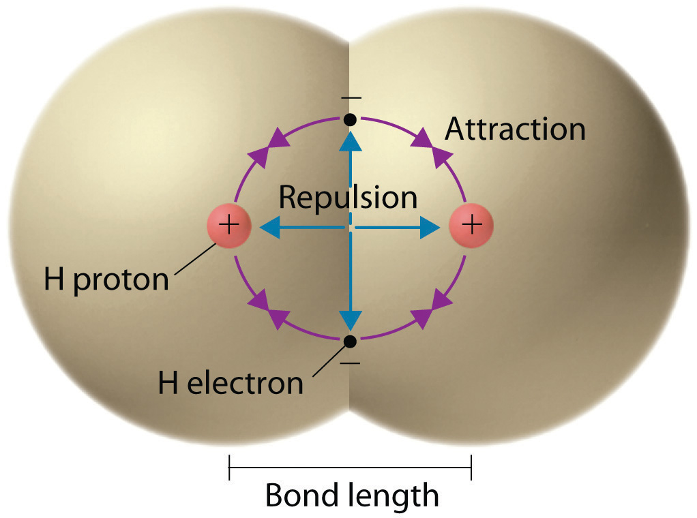

# Atomic Radii

We often treat individual atoms as spherical entities, where the border roughly represents the electron cloud.
While it isn't strictly true, this simplification provides motivation for studying chemical reactions using the notion of distance.

Recall that a sphere is uniquely defined by the length of its radius, the line segment from its center to any point on its boundary (see Figure\ \ref{fig:radius}).

{#fig:radius}

::: defboxed
When we treat an atom as a sphere, its _atomic radius_ is the radius of that sphere.
:::

We already know that certain atoms have different "sizes."
The concept of atomic radii makes this precise:
different elements—and even different atoms of the same element—have different atomic radii.

# Bond Length {#sec:bond-length}

Consider two atoms bonded together.
By virtue of being bonded, their spheres are right next to each other (_adjacent_) in physical space.
Then, as in Figure\ \ref{fig:adjacent}, the distance between the centers of these two atoms is just the sum of the atomic radii.[^overlap]

[^overlap]:
    This is another simplification.
    It is entirely reasonable for the spheres to overlap;
    this happens as a result of, for example, shared electron pairs due to covalent bonding.
    It also may be the case that there is a small gap between the spheres.
    Regardless, we should expect that the distance between the spheres is relatively close to the sum of the atomic radii.

::: figure
\centering
\input{images/adjacent-spheres.tikz}
\caption{Two adjacent spheres.
The distance between the centers is the sum of the individual radii.}
\label{fig:adjacent}
:::

## Why do we care about bond length?

Suppose you pull one of the two atoms from Section\ \ref{sec:bond-length} away so that they sit slightly further apart, and then you release it.
What would happen?

Well, as long as you didn't pull it so far apart that the atoms cannot interact, the atoms will tend towards the level of separation they started in.
The same would happen were you to have made them closer together.

The atoms in a bond sit at an equilibrium distance, due to certain cross-atomic forces cancelling out (_being equalized_).
Knowing the strength of this equilibrium (think of this as how much you are allowed to push or pull on the atoms as they stay bonded) tells us a lot about how much energy it takes to break the bond.

### Inter-atomic forces

So that we're not talking completely in the abstract, let's discuss the aforementioned cross-atomic forces.
For a more detailed view of these forces, including some of the mathematics involved, read the [electrostatics worksheet].

Atoms are composed of two types of charged subatomic particles: protons, which are positively charged, and electrons, which are negatively charged.
When two atoms are close enough, the particles in one atom can interact with the atoms in the other.

Recall that opposite charges attract and like charges repel.^[This is just a fancy way of saying that protons attract electrons, electrons attract protons, protons repel protons, and electrons repel electrons.]
This means that, as in Figure\ \ref{fig:attraction-repulsion}, there are some attractive forces and some repulsive forces between the atoms.
If you bring the atoms closer, you are significantly increasing the repulsive forces because you are reducing the distance between protons far more than the distance from electrons to protons.
Conversely, if you separate the atoms, you decrease repulsion far more than you decrease attraction.

{#fig:attraction-repulsion}

This explains why the equilibrium was _stable_;
no matter how you affected the distance, the atoms would try to self-correct.

\bibliographystyle{alpha}
\bibliography{ref}

[electrostatics worksheet]: https://pihart.github.io/worksheets/Chemistry%20I/Electrostatics/electrostatics.pdf
